<!-- hero: monochrome ASCII portrait beside a neofetch-style info panel.
     regenerate portrait: python scripts/prep_photo_flat.py <image> (flat art;
     use prep_photo.py for real photos) && python scripts/make_ascii_svg.py ;
     info panel: python scripts/make_info_card.py -->
<table>
<tr>
<td valign="top"></td>
<td valign="top"></td>
</tr>
</table>

## greenjacketcoder

**Automation · Security Tooling · AI Algo Trader**

<!-- TODO: fill in real URLs, then uncomment the badges you want

-->

 

<!-- animated contribution graph: real data, boxes reveal cell by cell
     (regenerated daily by .github/workflows/update-profile-art.yml) -->

